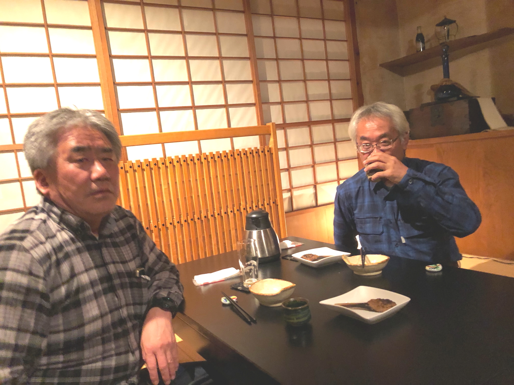

# CMBS
<html lang="ja">
 <head>
  <meta charset="utf-8" />
 

 <link href="https://cdnjs.cloudflare.com/ajax/libs/lightbox2/2.7.1/css/lightbox.css" rel="stylesheet">
   
</head>
<body>
<h1><marquee behavior="alternate">!!! CMBS開発者、飲み会の記録 !!!</marquee></h1>

2018/10/12、國酒の仕業 市川君撮影

                              

<marquee direction="right" scrollamount="20" width="30%">(^_^)/~hada</marquee>

<h2><marquee behavior="alternate">!!! 2021年11月26日、花子 !!!</marquee></h2>

  

     	
	
	
	
<h2><marquee behavior="alternate">!!! 2019年9月27日、石臼挽き手打ち蕎麦 こまめ !!!</marquee></h2>

<h3>おまけ↓ これから出勤のお姉様方に目が釘付けになる可哀想な（普通の？）サラリーマン。</h3>

  

     	

<h2><marquee behavior="alternate">!!! 2018年10月12日、國酒の仕業!!!</marquee></h2>

<h3>↓ 画像はクリックで拡大します。</h3>

<h3>パノラママジックで宇宙人らしき人が2名ほど居りますが、問題ありません～(^^♪</h3>

  

     		
	
	
<h2><marquee behavior="alternate">!!! 2015年11月13日、花子 !!!</marquee></h2>

<h3>↓ 画像はクリックで拡大します。</h3>

  

     	
<h2><marquee behavior="alternate">!!! 2012年9月21日、うずしお !!!</marquee></h2>

<h3>↓ 画像はクリックで拡大します。</h3>

  

<h3>・・・2018、開催宣言・・・ 
★★★★★★★★★★★★★★★★★★★★★★★★★★★★★★★★★★★★ 

From: Yoshihiro Urai (浦井 芳洋) 
Sent: Friday, September 28, 2018 1:59 PM 
To: Kenji Kodaka (小髙 賢二) <kenji_kodaka@n.t.rd.honda.co.jp>; Hiroyuki Koike (小池 弘之) <hiroyuki_koike@n.t.rd.honda.co.jp>; Hiroyuki Takagi (高木 啓之) <hiroyuki_takagi@n.t.rd.honda.co.jp>; Yoichi Sugimoto (杉本 洋一) <Yoichi_Sugimoto@n.t.rd.honda.co.jp>; Satoshi Hada (羽田 智) <satoshi_hada@n.t.rd.honda.co.jp>; Makoto Otabe (小田部 誠) <Makoto_Otabe@n.t.rd.honda.co.jp>; Shoji Ichikawa (市川 章二) <shoji_ichikawa@n.t.rd.honda.co.jp>; matsuda@sb4.so-net.ne.jp 
Subject: 10/12 CMBS同窓会のご案内  

メンバーの皆さん、  

 

場所、時間について連絡します。  

 

場所：國酒の仕業　宇都宮市大通り5-2-8　028-612-4992 

日時：10月12日（金）20:00～22:00（２hの時間制）　いつもより遅めの開始時間なのでご注意を！  

 

はなこもマンネリ化してきたかなということで、たまには別のお店にしてみました。日本酒のおいしそうなところです。 

浦井の名前で、2階席で予約してます。  

 

都合が悪くなり欠席ととなる場合は浦井まで連絡ください（できれば早めに）。  

 

当日、何かあればこちらまで。 

浦井の連絡先　080-4916-2253  

 

よろしくお願いします。 
       
>
> 差出人: "Shoji Ichikawa (市川 章二)" <shoji_ichikawa@n.t.rd.honda.co.jp> 
> 日時: 2018年10月1日 13:53:46 JST 
> 宛先: "Yoshihiro Urai (浦井 芳洋)" <yoshihiro_urai@n.t.rd.honda.co.jp>
> Cc: "Kenji Kodaka (小髙 賢二)" <kenji_kodaka@n.t.rd.honda.co.jp>, "Hiroyuki Koike (小池 弘之)" <hiroyuki_koike@n.t.rd.honda.co.jp>, "Hiroyuki Takagi (高木 啓之)" <hiroyuki_takagi@n.t.rd.honda.co.jp>, "Yoichi Sugimoto (杉本 洋一)" <Yoichi_Sugimoto@n.t.rd.honda.co.jp>, "Satoshi Hada (羽田 智)" <satoshi_hada@n.t.rd.honda.co.jp>, "Makoto Otabe (小田部 誠)" <Makoto_Otabe@n.t.rd.honda.co.jp>, "matsuda@sb4.so-net.ne.jp" <matsuda@sb4.so-net.ne.jp> 
> 件名: RE: 10/12 CMBS同窓会のご案内  
>
> いつもお世話になっています HGT 11G1ﾌﾞﾚｰｷGr 市川です 
>
> 浦井さん、お忙しいなか調整ありがとうございます 
>
> ”行った事のないお店”＋”松田さんと小田部さん”、なんか期待しちゃいます。 
>

 
       
From: Yoshihiro Urai (浦井 芳洋) 
Sent: Wednesday, August 29, 2018 6:45 PM 
To: Kenji Kodaka (小髙 賢二) <Kenji_Kodaka@n.t.rd.honda.co.jp>; Hiroyuki Koike (小池 弘之) <Hiroyuki_Koike@n.t.rd.honda.co.jp>; Hiroyuki Takagi (高木 啓之) <Hiroyuki_Takagi@n.t.rd.honda.co.jp>; Yoichi Sugimoto (杉本 洋一) <Yoichi_Sugimoto@n.t.rd.honda.co.jp>; Satoshi Hada (羽田 智) <Satoshi_Hada@n.t.rd.honda.co.jp>; Makoto Otabe (小田部 誠) <Makoto_Otabe@n.t.rd.honda.co.jp>; Shoji Ichikawa (市川 章二) <Shoji_Ichikawa@n.t.rd.honda.co.jp>; matsuda@sb4.so-net.ne.jp 
Subject: RE: CMBS同窓会のご案内  

 

浦井です。  

 

市川さん、小池さん、小高さん、 

返信ありがとうございます。 

これで全員分の予定が揃いました。  

 

現状で全員の都合のよい10/12に開催したいと思います。 

場所、時間は決定次第連絡します。 

お楽しみに。 

★★★★★★★★★★★★★★★★★★★★★★★★★★★★★★★★★★★★ </h3>

<h2><marquee behavior="alternate">!!! 2018年10月12日、國酒の仕業 集合写真　!!!</marquee></h2>

181012_國酒の仕業、羽田撮影

                                  	

  
  

<!-- フッタ -->
 <footer>
 Copyright 2018/10/12 S.Hada
 </footer>
